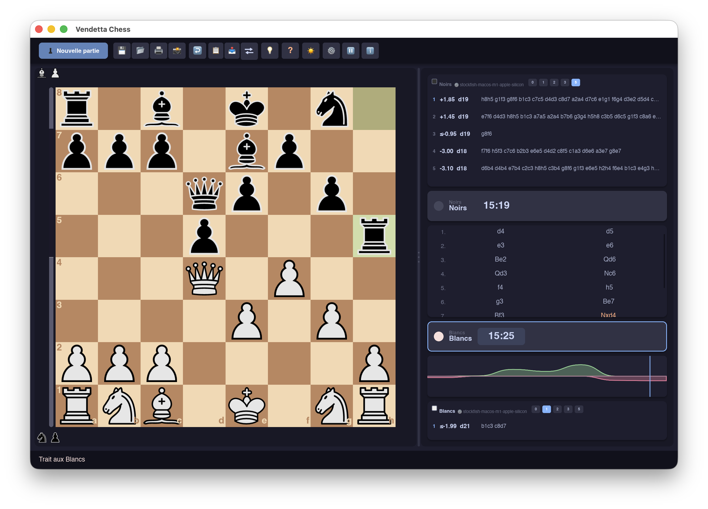

# ♟ Vendetta Chess GUI

**Professional chess graphical interface, written entirely in Rust.**

Vendetta Chess GUI contains **no internal chess engine**: it is a full UCI
client, designed to drive one or more external engines (Stockfish, Leela,
etc.), analyze games, manage a library of games and openings, organize
engine tournaments, and serve as a training tool — from beginner to
seasoned player, all within a single interface.




---

## Table of Contents

- [Features](#features)
- [Architecture](#architecture)
- [Installation](#installation)
- [Quick Start](#quick-start)
- [Development](#development)
- [Roadmap](#roadmap)
- [License](#license)

---

## Features

### Engines & analysis
- Full UCI protocol: launching, configuration, multi-engine management.
- Real-time analysis with **MultiPV** support (several simultaneous lines).
- Evaluation bar and graph, engine comparison.
- Engine tournaments (round-robin, gauntlet) with stored results.
- Dedicated "hint" engine, independent of the main analysis engine.

### Gameplay & notation
- Interactive board (click and drag-and-drop), SVG rendering.
- Full history with **PGN variations**, comments, and NAG annotations
  (`!!`, `!`, `!?`, `?!`, `?`, `??`).
- **Syntax-highlighted moves** in the history: captures, castling,
  promotion, check, and checkmate each get their own color.
- Highlighting of a king in check (pulsing square) and a dedicated
  checkmate animation.
- **Assist** mode: tactical badges (capture risk, check, mate) on the
  target squares of a selected piece — can be disabled, designed for
  beginners without forcing a separate mode.
- PGN, FEN, and EPD import/export; visual position editor.
- PDF export of a game (printing).
- Captured pieces displayed in real time.
- Full time-control management: classic, Fischer, Bronstein.

### Reference game database
- Import large reference game collections from **PGN** or **SCID** (`.si4`
  and `.si5`) files — e.g. Lumbra's Gigabase — as two independent sources
  (importing or clearing one never touches the other).
- Full-screen **browser** to search your reference database: filters by
  player, Elo range, date range, and ECO opening code, with pagination.
- Interactive **opening tree**: candidate moves with live statistics
  (games played, win rates), drill-down move by move, jump straight to
  the games behind any branch.
- **On-demand analysis** of any reference game: quick or deep engine pass,
  evaluation curve, live preview board with ply navigation, PGN/PNG
  export, FEN copy/paste.
- Start a new game directly from a position picked in the reference
  database, alongside the position editor and PGN loading.
- Move comments and NAG annotations (`!!`, `!`, `!?`, `?!`, `?`, `??`)
  from imported databases are decoded and preserved.

### Storage
- Local **SQLite** database: games, positions, analyses, tournaments.
- Opening library (Polyglot book).
- Fully portable installation (self-contained folder, usable from a USB drive).

### Training
- **Puzzle** mode with a dedicated database and progress tracking.

### Internationalization
- Interface available in **40 languages**, hot-switchable without a restart.
- All user-facing strings go through the central translation system
  (`crates/i18n`) — adding a language requires no code changes.

---

## Architecture

Multi-crate Rust workspace, with strict separation of concerns:

| Crate         | Role                                                                |
|---------------|----------------------------------------------------------------------|
| `core`        | Pure chess logic: board, legal moves, rules, PGN/FEN.                |
| `uci`         | Communication with external engines (UCI protocol).                  |
| `engine`      | Lifecycle management of engine processes (multi-engine pool).        |
| `analysis`    | MultiPV aggregation, engine comparison, evaluation graphs.           |
| `db`          | SQLite persistence (games, positions, analyses, tournaments, puzzles, reference databases). |
| `scid`        | Readers for the SCID database format (`.si4`/`.si5` index and name files, move blob decoding). |
| `tournament`  | Engine tournament organization (round-robin, gauntlet).              |
| `network`     | LAN multiplayer — *in progress* (see [Roadmap](#roadmap)).           |
| `game_config` | Game configuration (color, time control, engines involved).          |
| `i18n`        | Translations (40 languages) and the central translation function.    |
| `app_paths`   | Path resolution for the portable installation.                       |
| `gui`         | User interface (Slint) and overall orchestration.                    |

There is no direct coupling between the UI and the engines: everything goes
through dedicated services (`engine`, `analysis`, `db`).

**Tech stack**: Rust (2021 edition), [Slint](https://slint.dev) for the
interface, SQLite for persistence. `unsafe` is forbidden except for
documented, critical justification.

---

## Installation

### Requirements
- [Rust](https://rustup.rs) stable (toolchain via `rustup`).
- One or more UCI engines (e.g. [Stockfish](https://stockfishchess.org)),
  not bundled with the software.

### Building

```bash
git clone https://github.com/Fab2bprog/Rust-Vendetta-Chess-GUI.git
cd vendetta_chess_gui
cargo build --release
```

The resulting binary (`target/release/vendetta-chess-gui`) is self-contained and
relocatable; the software automatically recreates the data folder
structure it needs on first launch (see [Quick Start](#quick-start)).

### Linux — application menu integration

A ready-to-use `.desktop` file is provided in
[`crates/gui/linux/README.md`](crates/gui/linux/README.md), along with
user and system installation instructions.

---

## Quick Start

On first launch, Vendetta Chess GUI creates a `VendettaChess/` folder next
to the executable (portable installation, no writes elsewhere on the
system):

```
VendettaChess/
├── parametres/     preferences, configured engines, saved games
├── base/           SQLite database (games, analyses, tournaments, puzzles)
├── moteurs/        detected/installed UCI engine executables
├── ouvertures/     Polyglot opening book
└── logs/           logging
```

This folder can be copied as-is (e.g. onto a USB drive) to carry its
entire configuration and data over to another machine.

---

## Development

The project enforces strict quality rules, checked in continuous
integration (`.github/workflows`):

```bash
cargo check --all-targets --all-features
cargo fmt --all -- --check
cargo clippy --all-targets --all-features -- -D warnings -D clippy::all -D clippy::pedantic
cargo test --all-features
```

Compiler warnings are treated as errors (`RUSTFLAGS="-D warnings"`),
including clippy in pedantic mode.

Want to contribute? See [CONTRIBUTING.md](CONTRIBUTING.md) for the full
guide, and [`docs/`](docs/) for deeper architecture and design notes.

---

## Roadmap

Features from the specification that are still incomplete:

- **LAN multiplayer** — automatic discovery (mDNS), host/client mode,
  FEN-based synchronization, built-in chat. The `network` crate is in
  place but not yet implemented.
- **Piece themes** — only one SVG piece set is currently available; the
  classic Staunton style and an alternative modern style are still to be
  added.
- **Automatic game report** — NAG annotations (`!!`/`?`/`??`...) are
  currently assigned manually; an automatic analysis pass comparing the
  evaluation before/after each move does not yet exist.

---

## License

Distributed under the **GPLv3** license.
