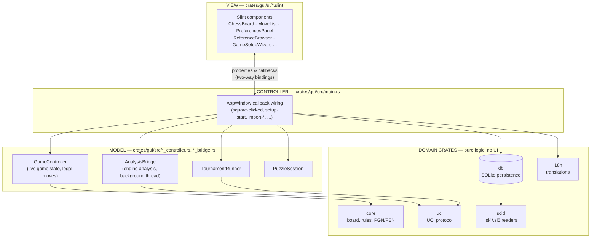
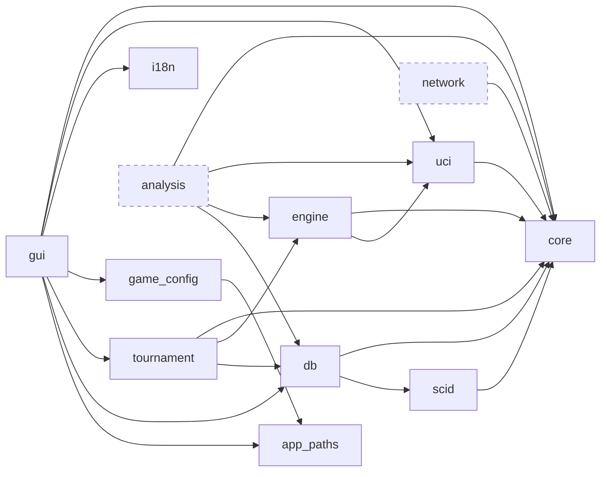
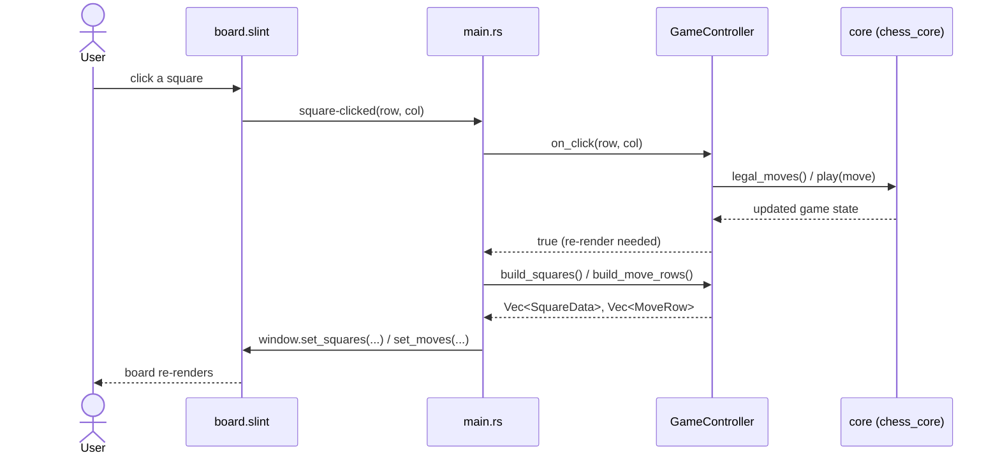
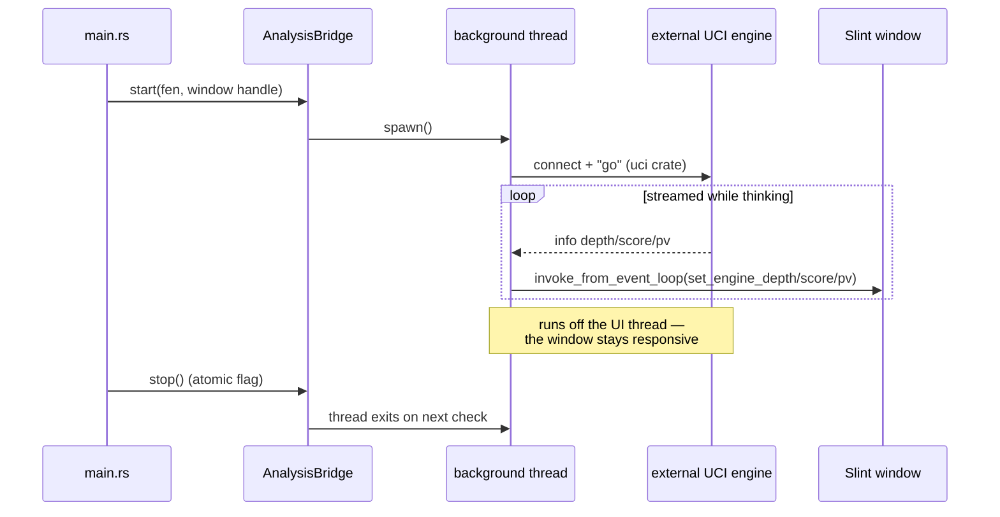
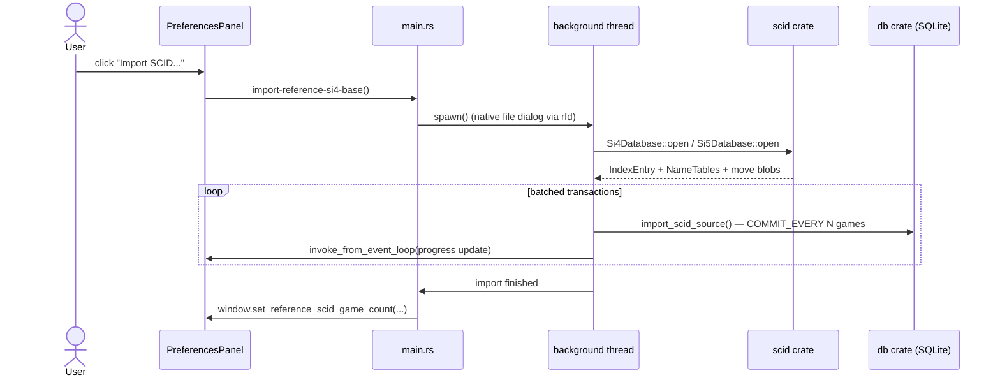

# Architecture

This document explains how Vendetta Chess GUI is put together: the
repository layout, the overall layering (View / Controller / Model), what
each of the 12 workspace crates is responsible for and which files live
where inside it, where data actually lives on disk at runtime, and how a
few representative user actions flow through the system end to end.

It is aimed at a programmer who has never opened this codebase before and
wants to answer, quickly: *"where do I find X?"* and *"if I touch Y, what
else might be affected?"*

All diagrams are [Mermaid](https://mermaid.js.org/) and render directly
on GitHub — no external tools needed to view them.

## Table of Contents

- [Repository layout](#repository-layout)
- [Layered design](#layered-design)
- [How this maps to MVC](#how-this-maps-to-mvc)
- [Crate dependency graph](#crate-dependency-graph)
- [Crate-by-crate deep dive](#crate-by-crate-deep-dive)
- [Where data lives at runtime](#where-data-lives-at-runtime)
- [`gui` crate module map](#gui-crate-module-map)
- [Request flow: playing a move](#request-flow-playing-a-move)
- [Request flow: engine analysis (background thread)](#request-flow-engine-analysis-background-thread)
- [Request flow: importing a SCID database](#request-flow-importing-a-scid-database)
- [Internationalization](#internationalization)
- [Build system & compilation pipeline](#build-system--compilation-pipeline)
- [Testing](#testing)
- [Where do I find X? — quick reference](#where-do-i-find-x--quick-reference)
- [Notes on crates not yet wired in](#notes-on-crates-not-yet-wired-in)

---

## Repository layout

```text
vendetta_chess_gui/
├── Cargo.toml                   workspace manifest — 12 members, shared
│                                 [workspace.package] metadata (version,
│                                 license, description, repository)
├── Cargo.lock
├── rustfmt.toml                 edition 2021, max_width 100, tab_spaces 4
├── .cargo/config.toml           RUSTFLAGS="-D warnings" + `cargo lint` /
│                                 `cargo fmt-check` aliases
├── .github/workflows/ci.yml     CI: check / fmt / clippy (pedantic) / test
├── LICENSE                      GPL-3.0-or-later, full text
├── README.md                    user-facing overview (English, GitHub landing page)
├── CONTRIBUTING.md               contributor guide (English)
├── RELEASE_NOTES_1.2.0.md       release notes, English / French / Spanish
├── docs/                         developer documentation (this folder)
│   ├── README.md                 index / how to navigate docs/
│   ├── ARCHITECTURE.md           this document
│   ├── scid-si4-specification.md full binary spec of the legacy SCID si4 format
│   └── scid-si5-specification.md full binary spec of the current SCID si5 format
├── crates/
│   ├── core/         chess rules, board, PGN/FEN, move generation — package name `core`
│   ├── uci/           UCI engine protocol client (process, parser, state machine)
│   ├── engine/         engine pool / config / comparator (used by `tournament`)
│   ├── gui/             the Slint application — produces the `vendetta-chess-gui` binary
│   ├── db/               SQLite persistence (application DB + reference games DB)
│   ├── analysis/          MultiPV aggregation, engine comparison, eval graphs
│   ├── tournament/         engine-vs-engine tournament logic (round robin / gauntlet)
│   ├── i18n/                translations — 39 languages, TOML-based
│   ├── network/             LAN multiplayer scaffolding (not implemented yet)
│   ├── game_config/         game configuration types + last-session persistence
│   ├── app_paths/           portable installation folder layout
│   └── scid/                 SCID `.si4`/`.si5` binary database format decoder
└── target/                    build artifacts (gitignored)
```

Every crate directory follows the same internal skeleton:
`Cargo.toml`, `src/lib.rs` (or `src/main.rs` for `gui`), and — where the
crate has non-trivial logic — a `tests/` folder for integration tests
alongside `#[cfg(test)] mod tests { ... }` blocks embedded directly in the
source files for unit tests. `gui` additionally has a `ui/` folder
(Slint files), an `assets/` folder (piece SVGs, branding), and a `linux/`
folder (`.desktop` file + install instructions).

---

## Layered design



The `.slint` files never contain application logic — they only declare
layout, styling, and the properties/callbacks a component exposes. Every
piece of actual behavior (what happens on a click, how a move is
validated, when a database import starts) lives in Rust.

## How this maps to MVC

The project doesn't follow textbook MVC to the letter — Slint itself is
closer to an MVVM framework (the `.slint` file *is* the view, driven by
two-way property bindings instead of a passive template) — but the same
separation of concerns applies:

| Classic role | In this project                                                        |
|---------------|-------------------------------------------------------------------------|
| **View**      | `crates/gui/ui/*.slint` — declarative layout and styling only.          |
| **Controller**| `crates/gui/src/main.rs` — receives Slint callbacks, decides what to do, pushes new state back to the View. |
| **Model**     | `game_controller.rs`, `analysis_bridge.rs`, `tournament_runner.rs`, `puzzle_session.rs` (the live, in-memory application state) **plus** the domain crates (`core`, `uci`, `db`, `scid`, `i18n`, ...) that hold the actual rules and persisted data. |

The View never talks to the domain crates directly — everything is
mediated by the Controller (`main.rs`), which is intentionally the
largest file in the project (**6,655 lines** — see the size table in
[Crate-by-crate deep dive](#crate-by-crate-deep-dive)): it is the seam
between "what the user did" and "what the application does about it."

## Crate dependency graph



Dashed borders mark crates that exist in the workspace but are **not**
currently reachable from the `gui` binary (see
[Notes on crates not yet wired in](#notes-on-crates-not-yet-wired-in)
below).

There is no dependency edge in either direction between `gui` and the
UI's actual rendering — Slint code generation (`build.rs` +
`slint-build`) turns `ui/app.slint` into Rust types at compile time,
which `gui/src/lib.rs` re-exports via `slint::include_modules!()`.

> **Naming quirk worth knowing:** the `core` crate's *package* name is
> `core`, but since `core` is reserved by the Rust standard library
> (`::core::pin`, `::core::result`, ...), every dependent crate imports it
> renamed: `chess_core = { path = "../core", package = "core" }` in
> `Cargo.toml`, then `use chess_core::...` in code. You will see
> `chess_core` used as the import name everywhere, never `core`.

---

## Crate-by-crate deep dive

For each crate: its role, its key modules, and (for the larger ones) a
size hint so you know what you are getting into before opening a file.
Sizes are line counts as of the v1.2.0 release, English comments.

### `core` (package `core`, imported as `chess_core`)

Pure chess logic. No I/O, no UI, no SQL — fully unit-testable in
isolation. The crate every other crate ultimately depends on.

| File | Role |
|---|---|
| `src/types/board.rs` (209 lines) | The 8×8 board representation. |
| `src/types/position.rs` (208) | Full position: board + side to move + castling rights + en passant + clocks. |
| `src/types/piece.rs` (170) | `Color`, `Piece`, `PieceKind`. |
| `src/types/square.rs` (144) | `Square` type, algebraic ↔ index conversions. |
| `src/types/chess_move.rs` (167) | `Move`, `MoveKind` (normal, capture, castle, en passant, promotion). |
| `src/types/evaluation.rs` (129) | `Evaluation`, `Score` (centipawns / mate-in-N). |
| `src/types/fen.rs` (438) | FEN parsing and serialization. |
| `src/types/game_state.rs` (52) | `GameResult` (ongoing, checkmate, stalemate, draw variants). |
| `src/movegen.rs` (752) | Legal move generation. |
| `src/rules.rs` (460) | Check/checkmate/stalemate detection, draw rules (50-move, repetition, insufficient material). |
| `src/game.rs` (751) | `Game`: a position plus its move history, the main object driving a live game. |
| `src/game_tree.rs` (1,392) | Move-tree with variations (mainline + sub-variations, NAGs, comments) — the in-memory model shared by the board view, move list, and PGN export. |
| `src/history.rs` (799) | Navigation through a game's move history (go to ply N, undo/redo). |
| `src/pgn.rs` (1,555) | PGN parsing and generation, including variations/NAGs/comments — the largest file in `core`. |
| `src/notation.rs` (229) | SAN (Standard Algebraic Notation) formatting. |
| `src/polyglot.rs` (758) | Polyglot opening book format (`.bin`) reader. |
| `src/events.rs` (229) | Domain events emitted by game state changes. |

### `uci` — UCI engine protocol client

Talks to an external UCI-compatible engine (Stockfish, Komodo, ...) as a
child process. No knowledge of the GUI or the board beyond FEN/move
strings.

| File | Role |
|---|---|
| `src/process.rs` (540) | Launches the engine as a child process; a dedicated thread reads stdout continuously into an `mpsc::channel`, enabling real `recv_timeout` calls without blocking the caller. |
| `src/parser.rs` (668) | Parses engine → GUI messages (`id`, `uciok`, `readyok`, `info depth/score/pv`, `bestmove`, ...). |
| `src/protocol.rs` (356) | Encodes GUI → engine commands (`uci`, `debug`, `isready`, `position`, `go`, `stop`, `quit`, ...). |
| `src/state.rs` (401) | Explicit state machine: `Idle → Initializing → Ready → (Thinking ⇄ Ready)`. |
| `src/engine.rs` (732) | `UciEngine` — the public facade assembling the four modules above into `connect()` / `go()` / `stop()`. |

### `engine` — engine pool, configuration, comparison

Sits above `uci`; manages a **pool** of configured engines (used mainly
by `tournament`, and conceptually by the still-unwired `analysis` crate).
Modules: `pool.rs`, `config.rs`, `comparator.rs`, `handle.rs`, `logger.rs`.

### `analysis` *(not currently wired into `gui`, see notes below)*

MultiPV aggregation, engine-vs-engine comparison, and evaluation-graph
helpers. Modules: `aggregator.rs`, `comparator.rs`, `graph.rs`, `store.rs`.
The running application currently reimplements equivalent logic directly
in `gui::analysis_bridge` instead of depending on this crate.

### `tournament` — engine-vs-engine tournaments

Round Robin (every engine plays every other; with `games_per_pair = 2`,
one game as White and one as Black per pair) and Gauntlet (challenger at
index 0 plays everyone else, others don't play each other) formats. FIDE
scoring (win=1.0, draw=0.5, loss=0.0). Single file: `src/lib.rs`, driven
at runtime by `gui::tournament_runner`.

### `db` — SQLite persistence (two independent databases)

See [Where data lives at runtime](#where-data-lives-at-runtime) for the
full schema. Two logically separate `SQLite` databases share this crate's
code but never the same file:

| File | Role |
|---|---|
| `src/schema.rs` (570) | Migrations for the **application** database (`base/vendetta.db`): `tournaments`, `games`, `positions`, `analyses`, `puzzles`, `puzzle_progress`. |
| `src/reference_schema.rs` (487) | Migrations for the **reference games** database (`bases_parties/reference*.db`): `games` (enriched: ECO, Elo, FIDE titles) + `game_positions` (opening tree source data). |
| `src/import_export.rs` (410) | PGN import/export for the application database. |
| `src/reference_import.rs` (679) | PGN import for the reference games database — enriched metadata, PGN kept byte-for-byte as-is (never regenerated). |
| `src/scid_import.rs` (267) | SCID (`.si4`/`.si5`) import — delegates all binary decoding to the `scid` crate, then calls `reference_import::import_one` per game, unmodified. |
| `src/eco_names.rs` (282) | ECO code → human-readable opening name lookup table. |
| `src/repository/*.rs` | One repository module per table/concern: `game_repo`, `position_repo`, `analysis_repo`, `tournament_repo`, `puzzle_repo`, `reference_game_repo`, `opening_repo` (the last two are PHASE 82 / reference-database only). |

### `scid` — SCID binary database format decoder

Pure binary format decoder, no `rusqlite`, no Slint dependency —
independently testable. Produces PGN text that `db::reference_import`
consumes unmodified. Supports both the legacy `si4` and the current `si5`
sub-formats (full specs: [scid-si4-specification.md](scid-si4-specification.md),
[scid-si5-specification.md](scid-si5-specification.md)).

| File | Role |
|---|---|
| `src/si4/` (`database.rs`, `index.rs`, `namebase.rs`) | si4-specific container reading (182-byte header, 47-byte fixed records, front-coded name file). |
| `src/si5/` (`database.rs`, `index.rs`, `namebase.rs`) | si5-specific container reading (no header, 56-byte fixed records, varint-encoded append-only name log). |
| `src/moves.rs` (184) | Move-byte decoding — **shared identically** between si4 and si5 (the encoded game content did not change between the two formats). |
| `src/game_blob.rs` (681) | Full per-game blob decoding: tags, flags, optional FEN, move list with variations/NAGs/comments. |
| `src/pgn_build.rs` (117) | Assembles decoded game data into PGN text. |
| `src/bytes.rs`, `src/dates.rs`, `src/eco.rs`, `src/entry.rs`, `src/names.rs`, `src/error.rs` | Low-level shared helpers (byte/varint reading, date codec, ECO codes, error types). |

### `i18n` — translations

See [Internationalization](#internationalization) below for the full
mechanism. `src/lib.rs` (707 lines) + one `locales/<code>.toml` file per
language (39 languages).

### `network` *(scaffolding only, not implemented)*

`src/lib.rs` is a single doc comment: *"LAN multiplayer (Phase 9, not yet
implemented)."* Present in the workspace so the crate boundary and its
place in the dependency graph are already reserved.

### `game_config` — game configuration types + last-session persistence

Represents a complete game setup (mode, colors, engines, time control) as
serializable types (`GameConfig`, `TimeControl`, `GameMode`), plus
`persist.rs` for saving/loading the last configuration used per mode
(so re-opening the app can offer "continue with the same setup").

### `app_paths` — portable installation folder layout

No dependencies beyond the standard library. Computes the application's
own folder from `std::env::current_exe()` on **every call** (never
cached), so the whole `VendettaChess/` delivery folder can be moved,
renamed, or put on a different USB drive letter between two runs without
breaking anything. See the full subfolder table in
[Where data lives at runtime](#where-data-lives-at-runtime).

### `gui` — the application itself

See [`gui` crate module map](#gui-crate-module-map) below for the full
breakdown of `src/*.rs`, and [Build system](#build-system--compilation-pipeline)
for how `ui/*.slint` gets compiled in.

---

## Where data lives at runtime

Vendetta Chess ships as a **portable, self-contained folder**
(`VendettaChess/`) — deliberately never using a system config directory
(`~/Library/Application Support`, `~/.config`, `%APPDATA%`), so the whole
folder can live on a USB drive and travel between computers unchanged.
This is computed by `app_paths::app_dir()` (parent of the running
executable) and created on first launch via `app_paths::ensure_app_dirs()`.

```text
VendettaChess/                      ← app_paths::app_dir()
├── vendetta-chess-gui               the executable itself
├── parametres/                      app_paths::parametres_dir()
│   ├── lang.txt                     saved UI language code (e.g. "en")
│   ├── engines.json                 remembered UCI engines (name, path, UCI options)
│   ├── hint_engine.txt              path of the "hint engine" (Puzzle mode), if set
│   ├── multipv_white.txt            MultiPV setting, White side
│   ├── multipv_black.txt            MultiPV setting, Black side
│   ├── puzzle_hint_theme.txt        "1"/"0" — show puzzle theme as a hint
│   ├── puzzle_hint_button.txt       "1"/"0" — show the puzzle hint button
│   ├── debug_mode_enabled.txt       "1"/"0" — enable diagnostic JSON logging
│   └── parties/                     app_paths::parametres_parties_dir()
│                                    latest game configuration per mode (JSON, game_config::persist)
├── base/                            app_paths::base_dir()
│   └── vendetta.db                  application SQLite DB (tournaments, games, positions,
│                                     analyses, puzzles, puzzle_progress)
├── moteurs/                         app_paths::moteurs_dir()
│                                    imported UCI engine executables (auto-renamed on collision:
│                                    stockfish, stockfish_2, stockfish_3, ...)
├── ouvertures/                      app_paths::ouvertures_dir()
│   ├── blancs.bin                   White Polyglot opening book (fixed name, app_paths::book_blancs_path())
│   └── noirs.bin                    Black Polyglot opening book (app_paths::book_noirs_path())
├── logs/                            app_paths::logs_dir()
│                                    optional diagnostic JSON logs (Preferences → Misc → Debug mode)
└── bases_parties/                   app_paths::bases_parties_dir()  — PHASE 82
    ├── reference.db                 reference games imported from an external PGN file
    │                                (app_paths::reference_pgn_db_path())
    └── reference_scid.db            reference games imported from a SCID .si4/.si5 database
                                     (app_paths::reference_scid_db_path()) — deliberately a
                                     SEPARATE file from reference.db: importing one never erases
                                     the other
```

All seven subfolders are created idempotently at startup; none of this
is ever written outside `VendettaChess/`.

### Engine / book paths: relative when possible

Once an engine or a book has been imported into `moteurs/`/`ouvertures/`,
its path is stored **relative** to `app_dir()` in `engines.json` /
`hint_engine.txt` (via `app_paths::to_relative_string` /
`to_absolute_path`) — so the whole folder keeps working after being moved
to another drive letter or mount point. A path that still points outside
`VendettaChess/` (not yet imported, or written by an older version of the
software before this convention existed) is kept absolute, unchanged —
nothing is lost, it just isn't "brought into" the portable folder yet.

### Application database schema (`base/vendetta.db`)

Managed by `db::schema`, versioned migrations (`migrations` table tracks
which have already run):

| Table | Purpose |
|---|---|
| `tournaments` | Name, site, date, kind (round robin / gauntlet). |
| `games` | Players, result, PGN, optional `tournament_id`, indexed by player name (plain + lowercase for case-insensitive search). |
| `positions` | Deduplicated positions by FEN, indexed. |
| `analyses` | UCI analyses linked to a position: engine, depth, score (cp or mate), best move, PV, nodes, time, MultiPV rank. |
| `puzzles` | Tactical puzzles imported by the user from a CSV file (typically a Lichess Puzzles export — no puzzle DB ships with the software). |
| `puzzle_progress` | Solved/attempted tracking per puzzle. |

### Reference games database schema (`bases_parties/reference*.db`)

Managed by `db::reference_schema` — **deliberately a separate file** from
the application database, so it can be deleted/reimported independently
without touching tournaments, puzzles, or engine analyses:

| Table | Purpose |
|---|---|
| `games` | Imported games with enriched metadata beyond the Seven Tag Roster: ECO, WhiteElo/BlackElo, WhiteTitle/BlackTitle (needed for game-list filters and the opening tree's adjustable Elo threshold). PGN text is kept byte-for-byte as imported, never regenerated. |
| `game_positions` | One row per (game, half-move) up to a fixed ply depth — the raw material the opening tree is aggregated from **at query time** (not pre-aggregated), specifically so the minimum-Elo filter stays adjustable by the user without ever re-importing the database. |

Both the PGN-file importer (`db::reference_import`) and the SCID importer
(`db::scid_import`) write into this same schema — the SCID importer does
so by asking the `scid` crate to decode each game to PGN text first, then
calling the exact same `reference_import::import_one` function used by
the PGN path, so there is only one place that actually writes rows.

---

## `gui` crate module map

| Module               | Size | Responsibility                                                              |
|-----------------------|-----:|-------------------------------------------------------------------------------|
| `main.rs`             | 6,655 | Entry point; wires every Slint callback to application logic (Controller). The single largest file in the project. |
| `game_controller.rs`  | 3,079 | Live game state: board, move history, variations, legal-move generation via `core`. |
| `i18n_bridge.rs`      | 979 | Applies the active language's strings to the Slint `Tr` global. |
| `pdf_export.rs`       | 1,107 | Renders a game/board to PDF for export. |
| `puzzle_session.rs`   | 875 | Puzzle-mode session state (current puzzle, attempt outcome, progress). |
| `chess_clock.rs`      | 593 | Time-control bookkeeping (classic, Fischer, Bronstein). |
| `analysis_bridge.rs`  | 550 | Runs engine analysis on a background thread, streams results back to the UI. |
| `prefs.rs`            | 503 | Reads/writes the portable installation's `parametres/` preferences files. |
| `game_bridge.rs`      | 446 | Converts `GameController` state into Slint-friendly types (`SquareData`, `MoveRow`). |
| `png_export.rs`       | 382 | Renders the board to a PNG image. |
| `engine_scan.rs`      | 314 | Auto-detects UCI engine binaries on disk. |
| `debug_log.rs`        | 312 | Optional JSON debug logging (Preferences → Misc). |
| `board_model.rs`      | 188 | Board-square data model feeding the Slint board component. |
| `tournament_runner.rs`| 121 | Drives an engine-vs-engine tournament (round-robin, gauntlet) via `tournament`. |
| `lib.rs`              | 39 | `slint::include_modules!()` + module declarations. |

`ui/*.slint` (17 files, ~11,600 lines total) — the largest are
`app.slint` (3,102 — the main window and every overlay/wizard),
`preferences.slint` (2,193), `game_setup.slint` (1,306),
`reference_browser.slint` (1,067), `game_detail.slint` (628),
`position_editor.slint` (569), `tournament_setup.slint` (527),
`language_setup.slint` (445), `translations.slint` (387, generated string
table), `move_list.slint` (429), `board.slint` (333),
`tournament_panel.slint` (208), `score_graph.slint` (117),
`captured_bar.slint` (100), `types.slint` (65), `tooltip_icon_button.slint`
(62), `theme.slint` (57, shared colors/spacing constants).

`assets/` holds the piece SVGs (`pieces/wK.svg`, `bQ.svg`, ...) and
branding SVGs (`branding/rust_logo.svg`, `corsica_flag.svg`).
`linux/` holds the `.desktop` file and its install instructions
(see [`linux/README.md`](../crates/gui/linux/README.md)).

## Request flow: playing a move

A concrete walk-through of what happens when the user clicks a square on
the board:



Everything above runs synchronously on the UI thread — move
generation and legality checking are fast enough (pure in-memory logic
in `core`) that no background thread is needed here.

## Request flow: engine analysis (background thread)

Talking to an external UCI engine process is not instantaneous, so it
must never block the UI thread. `AnalysisBridge` spawns a dedicated
thread and hands results back through Slint's own thread-safe callback,
`invoke_from_event_loop`:



## Request flow: importing a SCID database

The newest major feature (v1.2.0): importing a large `.si4`/`.si5` game
collection also runs off the UI thread, since parsing and inserting
potentially millions of games would otherwise freeze the interface for
minutes.



`core`'s move decoder and PGN builder are reused unmodified between the
`.si4` and `.si5` readers — only the index/name file formats differ
between the two; the encoded game content is identical (see
[scid-si4-specification.md](scid-si4-specification.md) and
[scid-si5-specification.md](scid-si5-specification.md) for the full
binary details).

---

## Internationalization

All user-visible strings go through the `i18n` crate — there should be
**no hardcoded UI string** anywhere in `.slint` files or in `main.rs`
outside of this mechanism.

- **39 languages**, one TOML file each in `crates/i18n/locales/`
  (`en.toml`, `fr.toml`, `de.toml`, `ja.toml`, `ar.toml`, ...).
- **`fr.toml` is the reference/source-of-truth language** — every
  translation key is added there first (currently 315+ keys); other
  locale files follow. **`en.toml` is the interface's default language**
  at first launch (changed from French on 05/07/2026, explicit product
  decision), not the source-of-truth file.
- `i18n::Lang` is the enum of supported languages (`Lang::Fr`,
  `Lang::En`, `Lang::It`, ... `#[default] En`).
- Translations are embedded **in the binary** at compile time via
  `include_str!()` — no runtime file reads, no missing-file failure mode,
  and the app remains a single portable executable.
- `i18n::translate("some.key")` returns the string for the
  currently active language (`i18n::set_lang(Lang::En)` to switch — no
  restart required).
- `gui::i18n_bridge` (979 lines) is the bridge that pushes every
  translated string into the Slint `Tr` global whenever the language
  changes, so `.slint` files reference `Tr.some-key` and get live updates.
- The chosen language is persisted to `parametres/lang.txt`
  (`gui::prefs::save_lang` / `load_lang`) — first launch (`lang.txt`
  absent) triggers the in-app language-selection screen
  (`language_setup.slint`).

## Build system & compilation pipeline

- **Slint compilation**: `crates/gui/build.rs` calls
  `slint_build::compile("ui/app.slint")` at build time. Since `app.slint`
  `import`s all the other `.slint` files, this single entry point pulls
  in the whole UI tree. The generated Rust code is brought into scope by
  `slint::include_modules!()` in `crates/gui/src/lib.rs`, which is what
  makes `AppWindow`, `Tr`, `SquareData`, etc. available as ordinary Rust
  types elsewhere in the crate.
- **Binary name vs. crate name**: the crate is named `gui` (idiomatic
  snake_case, used for workspace path dependencies), but
  `crates/gui/Cargo.toml` declares a `[[bin]] name = "vendetta-chess-gui"`
  section so the compiled executable users actually run is named
  `vendetta-chess-gui`, not the bare `gui`.
- **Workspace metadata inheritance**: `version`, `edition`, `authors`,
  `license`, `description`, `repository` are declared once in the root
  `Cargo.toml`'s `[workspace.package]` and pulled into every member crate
  via `field.workspace = true` — the version number in particular has a
  single canonical source, read at compile time via
  `env!("CARGO_PKG_VERSION")` in `main.rs` and shown in the "About"
  window; it is never duplicated or hardcoded elsewhere.
- **Release profile** (`[profile.release]` in the root `Cargo.toml`):
  `opt-level = 3`, `lto = "fat"`, `codegen-units = 1`, `strip = true`.
  `panic` is deliberately left at its default (`unwind`, not `abort`) so
  a panic inside an engine/analysis background thread only kills that
  thread, not the whole application.
- **Lint/format enforcement**: `.cargo/config.toml` sets
  `RUSTFLAGS = "-D warnings"` globally and defines two aliases,
  `cargo lint` (clippy, `-D clippy::all -D clippy::pedantic`, with
  `module_name_repetitions` explicitly allowed) and `cargo fmt-check`.
  `rustfmt.toml` pins edition 2021, `max_width = 100`, `tab_spaces = 4`,
  `imports_granularity = "Crate"`, `group_imports = "StdExternalCrate"`.
- **CI** (`.github/workflows/ci.yml`, GitHub Actions, triggers on push to
  `main`/`develop` and PRs to `main`): four independent jobs — `check`
  (`cargo check --all-targets --all-features`), `fmt`
  (`cargo fmt --all -- --check`), `clippy` (same pedantic ruleset as the
  local alias), `test` (`cargo test --all-features`) — all with
  `RUSTFLAGS="-D warnings"`.
- **macOS packaging**: `crates/gui/Cargo.toml` has a
  `[package.metadata.bundle]` section (name, bundle identifier, category,
  short/long description) consumed by the external `cargo-bundle` tool to
  produce a `.app` bundle — unrelated to the standard crates.io
  `description`/`repository` fields also present in the manifest.
- **Linux packaging**: `crates/gui/linux/vendetta-chess.desktop` +
  install instructions in `crates/gui/linux/README.md` (user-local vs.
  system-wide install, `update-desktop-database`, icon setup).

## Testing

- **Unit tests** live next to the code they test, in
  `#[cfg(test)] mod tests { ... }` blocks at the bottom of the same
  source file (the pattern used throughout — see e.g.
  `crates/app_paths/src/lib.rs`, `crates/gui/src/prefs.rs`). This is the
  large majority of the test suite.
- **Integration tests** live in a crate's `tests/` folder, one file per
  feature phase, named after the project's internal phase-numbering
  convention (cross-referenced with the internal planning log, outside
  this repository): `crates/engine/tests/phase4_integration.rs`,
  `crates/analysis/tests/phase5_integration.rs`,
  `crates/gui/tests/phase16_integration.rs`,
  `crates/gui/tests/phase26_integration.rs`.
- **Test isolation from real user data**: anything that touches
  `app_paths`-resolved locations is careful to redirect to a temporary
  directory under `#[cfg(test)]` rather than the real `parametres/`
  folder — see `gui::prefs::prefs_dir()`'s two implementations
  (`#[cfg(not(test))]` vs `#[cfg(test)]`). This was a deliberate fix for
  a historical bug where running `cargo test` repeatedly could pollute a
  developer's real preferences folder.
- Run the full suite the same way CI does: `cargo test --all-features`.
  Lint locally with `cargo lint` / format-check with `cargo fmt-check`
  (both aliases defined in `.cargo/config.toml`).

---

## Where do I find X? — quick reference

| I want to... | Look at |
|---|---|
| Change what happens when a UCI callback fires from the UI | `crates/gui/src/main.rs` |
| Change board/move legality logic | `crates/core/src/movegen.rs`, `rules.rs` |
| Change how a game is displayed/navigated (variations, history) | `crates/core/src/game_tree.rs`, `history.rs`; bridged via `crates/gui/src/game_controller.rs` |
| Add or fix a PGN import/export edge case | `crates/core/src/pgn.rs` (parsing/generation logic) or `crates/db/src/import_export.rs` / `reference_import.rs` (DB-level import) |
| Change how engine analysis is run or displayed | `crates/gui/src/analysis_bridge.rs`; protocol-level details in `crates/uci/` |
| Add a UCI command or parse a new engine message | `crates/uci/src/protocol.rs` (GUI→engine) / `parser.rs` (engine→GUI) |
| Add or edit a translation string | `crates/i18n/locales/fr.toml` first (source of truth), then mirror the key in the other 38 locale files; wiring in `crates/gui/src/i18n_bridge.rs` |
| Add a new Slint screen/dialog | new file under `crates/gui/ui/`, imported from `app.slint`; wire its callbacks in `main.rs` |
| Change a preferences file's format or add a new setting | `crates/gui/src/prefs.rs`; the on-disk location comes from `crates/app_paths/src/lib.rs` |
| Add a new application-database table or query | `crates/db/src/schema.rs` (migration) + a new/updated file in `crates/db/src/repository/` |
| Add a new reference-games-database table or query | `crates/db/src/reference_schema.rs` + `crates/db/src/repository/reference_game_repo.rs` or `opening_repo.rs` |
| Fix a SCID `.si4`/`.si5` decoding bug | `crates/scid/src/` — `si4/` or `si5/` for container-level fields, `game_blob.rs`/`moves.rs` for move/comment decoding (shared by both formats); full spec in `docs/scid-si4-specification.md` / `docs/scid-si5-specification.md` |
| Change tournament pairing/scoring logic | `crates/tournament/src/lib.rs`; runtime driver in `crates/gui/src/tournament_runner.rs` |
| Change puzzle import (CSV) or puzzle session behavior | `crates/db/src/repository/puzzle_repo.rs` (import/storage) / `crates/gui/src/puzzle_session.rs` (session state machine) |
| Change PDF or PNG export rendering | `crates/gui/src/pdf_export.rs` / `png_export.rs` |
| Change portable-install folder layout or add a new subfolder | `crates/app_paths/src/lib.rs` |
| Bump the software version | root `Cargo.toml`'s `[workspace.package] version` — the single source, propagated everywhere via `.workspace = true` |
| Change CI checks or lint rules | `.github/workflows/ci.yml` + `.cargo/config.toml` + `rustfmt.toml` |
| Change the compiled binary's name or packaging metadata | `crates/gui/Cargo.toml` (`[[bin]]` section for the executable name, `[package.metadata.bundle]` for macOS) |

## Notes on crates not yet wired in

Two workspace crates exist but are not currently reachable from the
`gui` binary's dependency graph — worth knowing before assuming a
change to them will have any visible effect:

- **`analysis`** — provides MultiPV aggregation, engine comparison, and
  evaluation-graph helpers, with its own test suite. The running
  application currently implements its analysis and MultiPV display
  directly in `gui::analysis_bridge`, talking to `uci` on its own,
  rather than going through this crate. Whether `analysis` should be
  adopted by `gui` (removing duplicated logic) or repurposed for a
  different use case (e.g. batch engine comparison, PHASE reports) is
  an open question.
- **`network`** — scaffolding for LAN multiplayer (see the
  [README's roadmap](../README.md#roadmap)). Not implemented yet, so
  nothing in `gui` depends on it.
